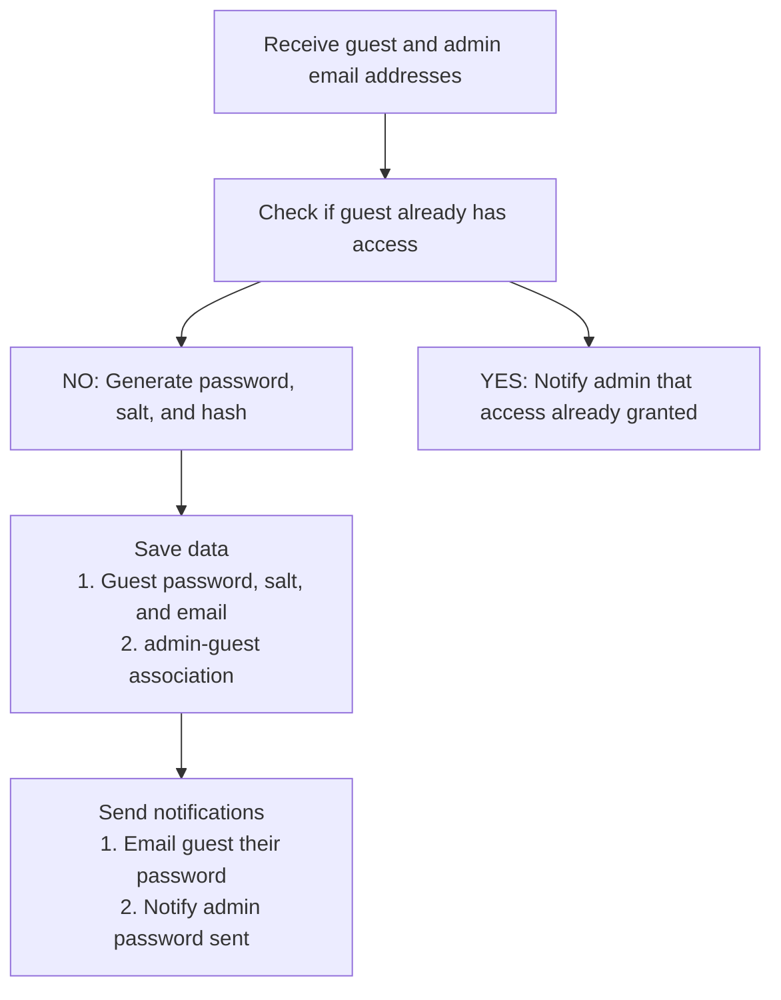
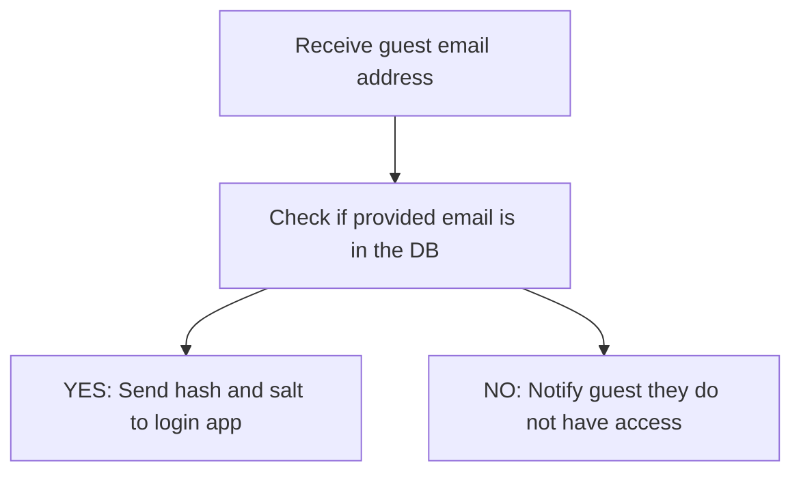

# Readme

Serverless functions to grant temporary upload ability to Aprimo.

## Functions

### Provision Access

### Grant Access

### Upload File(s)

## Todo

- [ ] Web portal for admin to add guest user email
- [ ] Okta authentication for admin portal
- [ ] Save guest user - admin relationship to DB
- [ ] Check if user already has access
- [x] Generate guest user password and seed
- [ ] Send guest user email with password
- [x] Hash the password salt combo
- [x] Save the hash and the salt to the DB with the user email
- [ ] Upload portal for guest user
- [ ] User inputs email and password
- [ ] Retrieve the salt and the hash from the DB
- [ ] Hash the password input with the retrieved salt
- [ ] Compare the hashes and if matched grant access
- [ ] Upload files from input to S3
- [ ] Clean up DB removing user entry with one-time password
