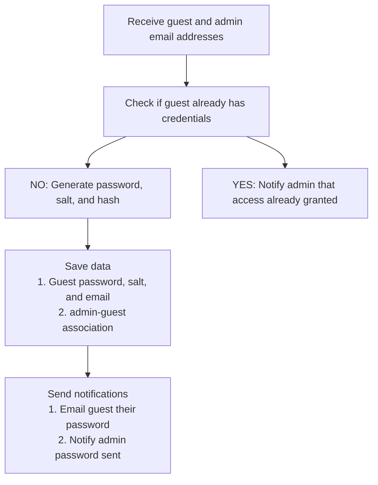
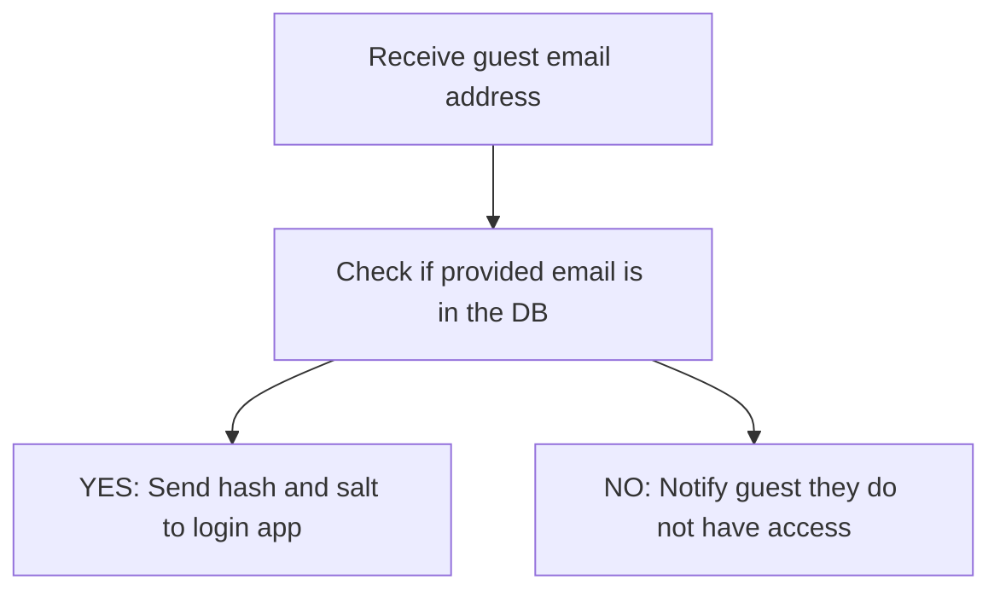

# Readme

Serverless functions to grant temporary upload ability to Aprimo.

## Functions

### Provision Credentials

### Grant Access

### Upload File(s)

## Todo

- [ ] Web App - Page for admin to add guest user email
  - [ ] Okta authentication for admin portal
  - [ ] Input form for guest email
  - [ ] Provide guest user access (Provision Credentials Lambda)
  - [ ] Manage existing invites?
- [ ] Lambda Function - Provision Credentials
  - [ ] Receive input from Web App admin page
  - [x] Check if provided user email already has credentials
  - [ ] If so notify admin (else proceed as below)
  - [x] Save guest user - admin relationship to DB
  - [x] Generate guest user password and salt
  - [x] Hash the password salt combo
  - [x] Save the hash and the salt to the DB with the user email
  - [ ] Send guest user email with password
  - [ ] Notify admin inviter that password has been sent
- [ ] Web App - Guest upload portal
  - [ ] User inputs email and password
  - [ ] Retrieve the hash and salt from the DB (Grant Access Lambda)
  - [ ] Hash the password input with the retrieved salt
  - [ ] Compare the hashes and if matched grant access
  - [ ] Allow authenticated user to upload documents (Upload Files Lambda)
  - [ ] Record access?
  - [ ] On completed upload, remove user access (Cleanup Lambda)
- [ ] Lambda Function - Grant Access
  - [ ] Receive input from Web App guest page
  - [ ] Check if provided user email has access
  - [ ] If not, notify guest they do not have access (else proceed as below)
  - [ ] Send the guest hash and salt to the Web App guest page
- [ ] Lambda Function - Upload files
  - [ ] Upload files from input to S3
- [ ] Lambda Function - Cleanup
  - [ ] Receive input from Web App guest page
  - [ ] Removing user from access list
- [ ] Lambda Function - Publish Upload to Aprimo
- [ ] Lambda Function - Add new admin user
  - [ ] Receive input from Web App admin page
  - [x] Check if provided user email belongs to an existing user
  - [x] Save user to the list of admins
- [ ] Lambda Function - Deactivate admin user
  - [ ] Receive input from Web App admin page
  - [ ] Check if provided user email is indeed an admin
  - [ ] Set the `active` status on their entry to `false`
